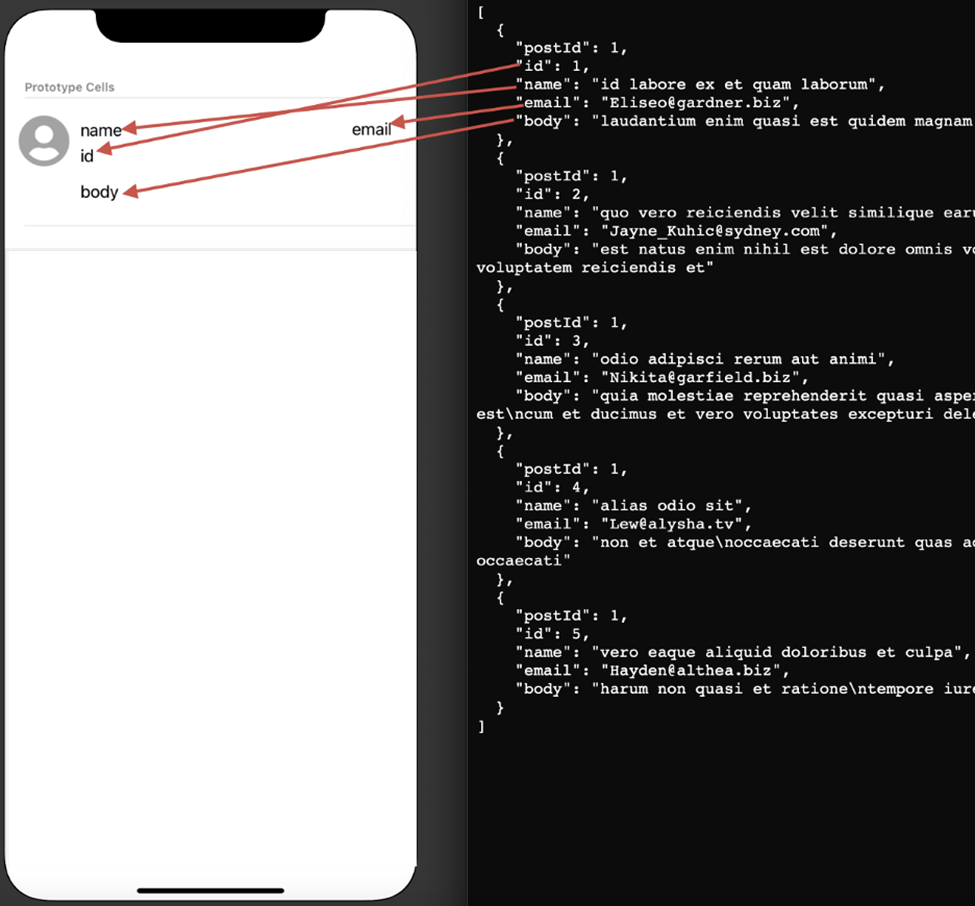
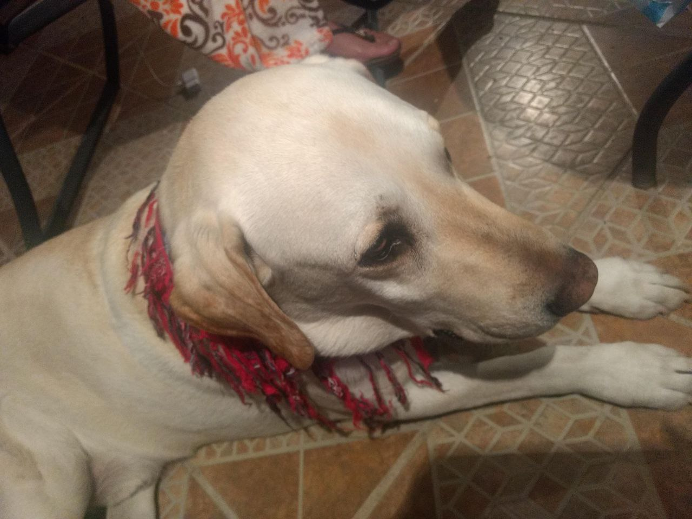
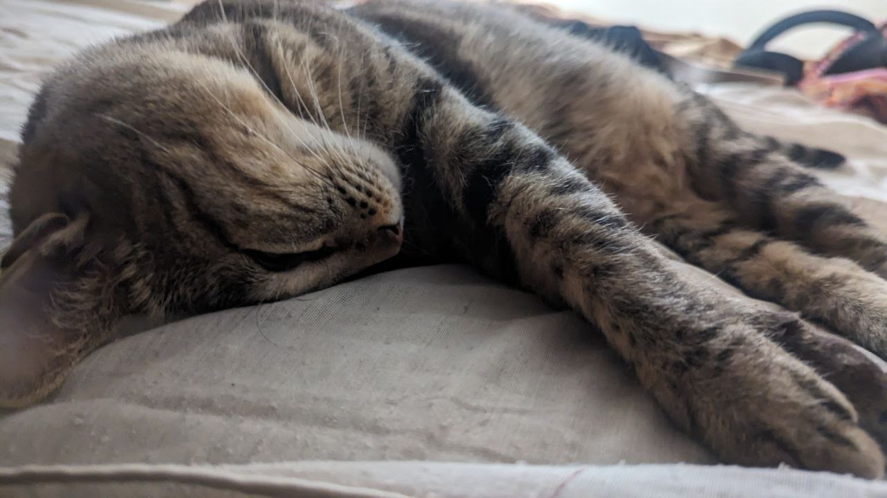
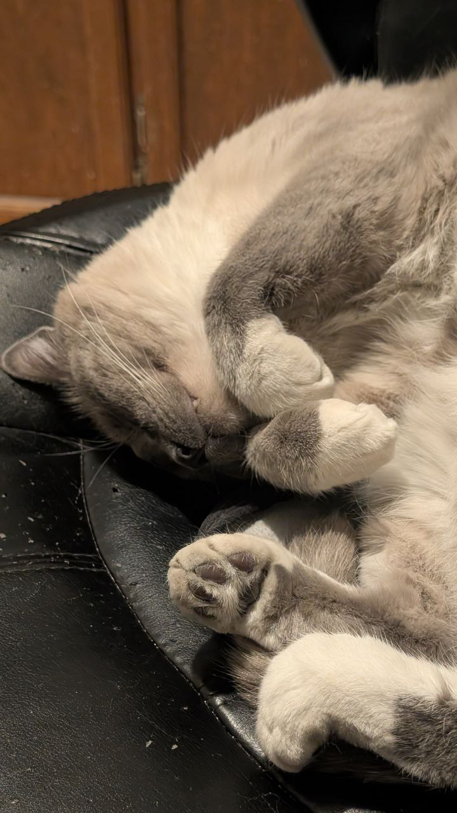

# LPL Super Pony Up (First thing that came to my mind)

This application displays a list of comments from a JSON API. Below is a technical overview of the implementation.

## Technical Implementation

### Architecture
- **Pattern**: MVVM (Model-View-ViewModel) architecture
- **UI**: Built with Jetpack Compose
- **State Management**: Kotlin Flow for reactive state updates
- **Dependency Injection**: Hilt for dependency injection
- **Build Variants**: Supports 'mock' and 'prod' flavors for development and production environments

### Network
- **API Client**: Retrofit for network requests
- **Endpoint**: https://jsonplaceholder.typicode.com/posts/1/comments
- **Data Classes**: Model separation between DTOs (Data Transfer Objects) and Domain models

### Testing
- **UI Tests**: Compose UI testing with ComposeTestRule
  - Tests for loading, success, error, and initial states
  - Component rendering verification
- **Unit Tests**: Repository implementation tests with mock data
- **Mock Data**: JSON mock data for offline testing

### Future Enhancements
- Room database implementation for offline caching
- Splash screen
- Custom app icon
- Specific error messages based on HTTP codes
- Enhanced accessibility features
- Extended test coverage
- Additional user comments features
- Further testing
- Bigger screens implementation
- Extended error handling

## Demo Images

Original request:

Implement Java and MVVM architecture-based project to achieve below features.
Use all jetpack components that you can use here.

1. Build a screen as shown below with json data mapping
   
2. Consume below web service to build the screen (Use retrofit library)
   https://jsonplaceholder.typicode.com/posts/1/comments

3. Currently in the service we don’t have an attribute to show the profile image, default show the
   place holder icon as shown
4. Provide the action on profile place holder icon to replace with new icon from photo gallery
5. App should be universal app, will work on landscape and portrait mode
6. Make sure any text shown on screen should not truncate
7. Any suggestion on current UI design are most welcome
8. When completed, please upload to GIT HUB and be prepared to not only walk through the code but
   demo the project.

Not so professional photos of my pets:

Here is a photo of my dog:  

And of my cats:  

